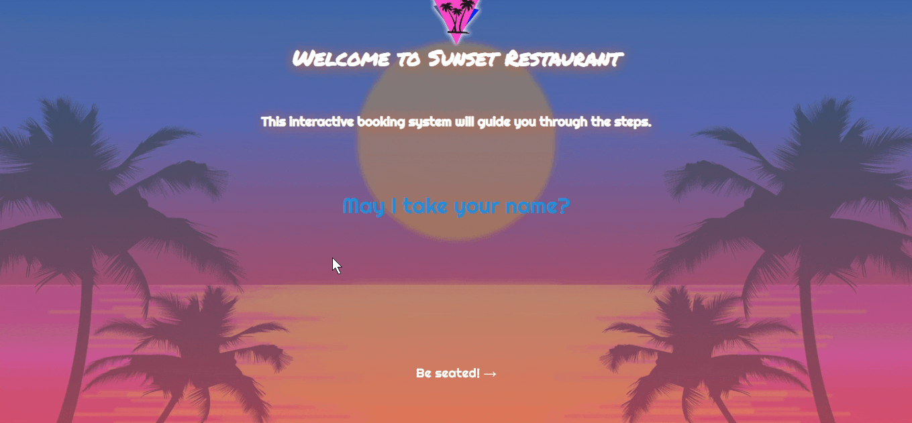
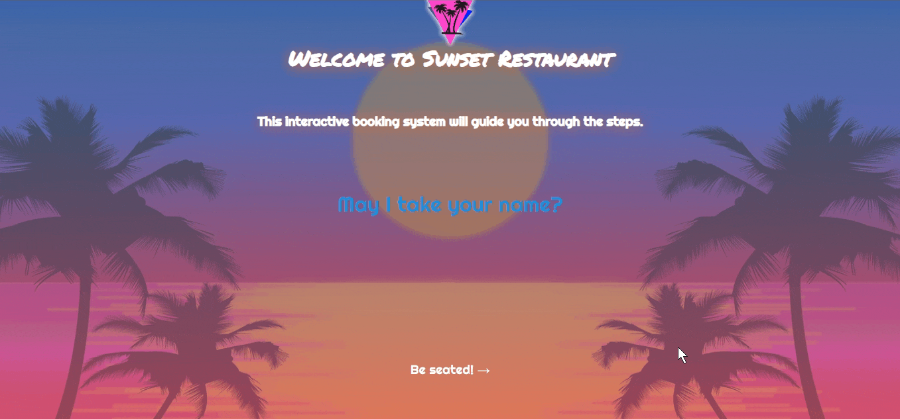
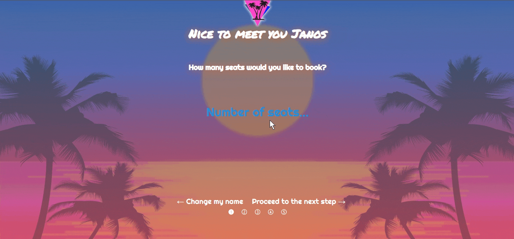

# restaurant-webapp

This is a personal project to practice fron-end design and DOM manipulation.

'Sunset Restaurant' was built using HTML, Sass, and JS.

'Sunset Restaurant' is a fake restaurant featuring an '80s theme.

The user is greeted with a name input field, then the user is asked the seat count, date, time. After that, the user is shown a selection of food to preorder.
At the end, the user is shown a summary of booking details to confirm everything is correct.

The web app also checks for errors in inputs.

